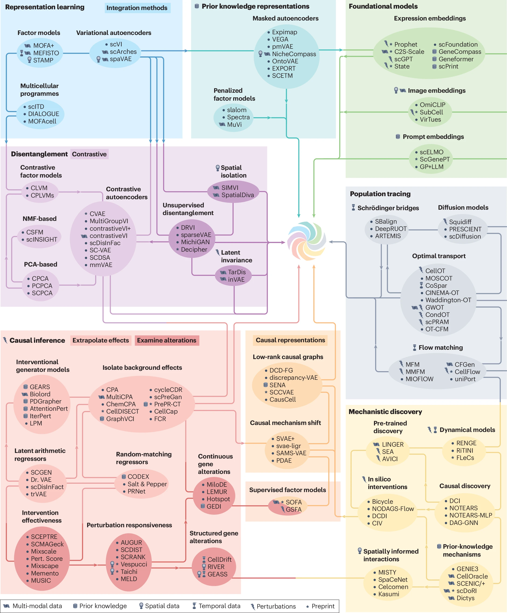

Interpretation, Extrapolation, and Perturbation of Single Cells
=====================================================================================

.. raw:: html

   

.. |stars-badge| image:: https://img.shields.io/github/stars/dbdimitrov/interp-extrap-perturb?style=social
   :target: https://github.com/dbdimitrov/interp-extrap-perturb/stargazers
   :alt: GitHub stars

.. |license-badge| image:: https://img.shields.io/github/license/dbdimitrov/interp-extrap-perturb
   :target: https://github.com/dbdimitrov/interp-extrap-perturb/blob/main/LICENSE
   :alt: License

.. |repo-badge| image:: https://img.shields.io/badge/GitHub-repo-black?logo=github&logoColor=white
   :target: https://github.com/dbdimitrov/interp-extrap-perturb
   :alt: Project repository

.. |methods-badge| image:: https://img.shields.io/badge/methods-149-blue.svg
   :target: methods.html
   :alt: Methods count

.. |prs-badge| image:: https://img.shields.io/badge/PRs-welcome-brightgreen.svg
   :target: contribute.html
   :alt: PRs welcome

|repo-badge| |stars-badge| |license-badge| |methods-badge| |prs-badge|

.. raw:: html

   

.. raw:: html

   

   <h3>🌟 <strong>Ready to Explore?</strong> 🌟</h3>
   

   <a href="methods.html" class="btn-primary">🔍 Browse All Methods</a>
   &nbsp;&nbsp;
   <a href="contribute.html" class="btn-secondary">➕ Add Your Method</a>
   

   

   

---

**Documentation Contents**
-------------------------------

📚 **A Living Catalogue of Single-Cell Perturbation Methods**

Single-cell genomics is moving beyond cell atlases toward models that **interpret and extrapolate cellular responses to perturbations**. 
This webpage lists technical details for more than **149 of these methods**. Moreover, as part of a `perspective <https://doi.org/10.1038/s41576-025-00920-4>`_, 
it aims to help researchers pick the right tool and highlight open challenges for future method advances.

.. raw:: html

   

   
<strong>🎯 Mission</strong>: Helping researchers navigate the rapidly evolving landscape of single-cell perturbation analysis

   

   **An ontology for modelling alterations and response**

---

.. toctree::
   :maxdepth: 1
   :caption: 📚 Catalog Navigation

   ⚙️ All Methods <methods>
   ➕ Contribute <contribute>

Citation
--------

Dimitrov*, D., Schrod*, S., Rohbeck, M., and Stegle, O. Interpretation, extrapolation and perturbation of single cells. *Nat Rev Genet* (2026). https://doi.org/10.1038/s41576-025-00920-4